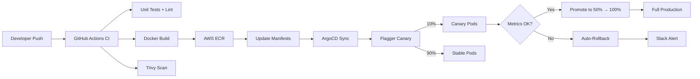

# 🚀 GitOps Pipeline — Multi-Environment with Canary Deployments & Full-Stack Observability

[](https://github.com/org/gitops-platform/actions/workflows/ci.yaml)
[](https://github.com/org/gitops-platform/actions/workflows/terraform.yaml)

A production-grade GitOps platform implementing automated CI/CD pipelines with progressive delivery (canary deployments), full-stack observability, and defense-in-depth security. Built on AWS EKS with ArgoCD, Flagger, Istio, and a complete monitoring stack.

---

## 📐 Architecture

```
Developer Push → GitHub Actions (CI) → ECR → ArgoCD → EKS + Istio
                                                        ↓
                                                   Flagger Canary
                                                  10% → 50% → 100%
                                                        ↓
                                              Prometheus → Grafana
                                              Loki → Tempo → Alerts
```

### Data Flow



### Infrastructure

| Component | Technology | Purpose |
|-----------|-----------|---------|
| Cloud | AWS (EKS, ECR, RDS, S3) | Infrastructure |
| IaC | Terraform | Infrastructure provisioning |
| GitOps | ArgoCD | Kubernetes declarative deployments |
| Service Mesh | Istio | Traffic management, mTLS |
| Progressive Delivery | Flagger | Canary analysis + auto-rollback |
| CI/CD | GitHub Actions | Build, test, scan pipelines |
| Monitoring | Prometheus + Grafana | Metrics + dashboards |
| Logging | Loki + Promtail | Log aggregation |
| Tracing | Tempo | Distributed tracing |
| Security | Trivy, OPA/Gatekeeper, Vault | Image scanning, policy enforcement, secrets |

---

## 📁 Repository Structure

```
├── infra/
│   ├── terraform/
│   │   ├── modules/          # Reusable Terraform modules
│   │   │   ├── vpc/          # VPC, subnets, NAT, VPC endpoints
│   │   │   ├── eks/          # EKS cluster, node groups, IRSA
│   │   │   ├── rds/          # PostgreSQL Multi-AZ
│   │   │   └── ecr/          # Container registry
│   │   ├── environments/
│   │   │   ├── staging/      # Staging configuration
│   │   │   └── production/   # Production configuration
│   │   └── shared/
│   │       └── s3-tfstate/   # Bootstrap state bucket
│   └── k8s/
│       ├── base/             # Kustomize base manifests
│       └── overlays/
│           ├── staging/      # Staging overlay + Flagger canary
│           └── production/   # Production overlay + Flagger canary
├── apps/
│   └── my-app/               # Sample Go microservice
├── pipelines/
│   └── .github/workflows/    # CI, manifest update, Terraform
├── observability/
│   └── helm/                 # Prometheus, Grafana, Loki, Tempo
├── security/
│   ├── trivy-config.yaml     # Image scanning config
│   ├── vault/policies/       # HashiCorp Vault policies
│   └── policy/               # OPA/Gatekeeper constraints
└── argocd/
    ├── projects/             # ArgoCD AppProjects
    └── applications/         # ArgoCD Application CRs
```

---

## 🏗️ Implementation Phases

| Phase | Focus | Status |
|-------|-------|--------|
| **Phase 1** | Infrastructure (VPC, EKS, RDS, ECR) | ⬜ |
| **Phase 2** | CI Pipeline (Build, Test, Scan, Push) | ⬜ |
| **Phase 3** | GitOps + Progressive Delivery (ArgoCD, Flagger) | ⬜ |
| **Phase 4** | Observability (Prometheus, Grafana, Loki, Tempo) | ⬜ |
| **Phase 5** | Security (Trivy, OPA, Vault/ESO) | ⬜ |
| **Phase 6** | Alerting & Auto-Rollback | ⬜ |
| **Phase 7** | Testing, Tuning & Documentation | ⬜ |

---

## 🚦 Quick Start

### Prerequisites

- AWS CLI configured with appropriate permissions
- Terraform >= 1.7.0
- kubectl
- kustomize
- Helm 3
- istioctl

### 1. Bootstrap Terraform State

```bash
cd infra/terraform/shared/s3-tfstate
terraform init
terraform apply
```

### 2. Deploy Infrastructure (Staging)

```bash
cd infra/terraform/environments/staging
terraform init
terraform plan
terraform apply
```

### 3. Install Istio

```bash
istioctl install --set profile=default -y
kubectl label namespace my-app-staging istio-injection=enabled
```

### 4. Install ArgoCD

```bash
kubectl create namespace argocd
kubectl apply -n argocd -f https://raw.githubusercontent.com/argoproj/argo-cd/stable/manifests/install.yaml
kubectl apply -f argocd/projects/
kubectl apply -f argocd/applications/
```

### 5. Install Flagger

```bash
helm repo add flagger https://flagger.app
helm upgrade -i flagger flagger/flagger \
  --namespace=istio-system \
  --set meshProvider=istio \
  --set metricsServer=http://kube-prometheus-stack-prometheus.monitoring:9090
```

### 6. Deploy Observability Stack

```bash
helm repo add prometheus-community https://prometheus-community.github.io/helm-charts
helm repo add grafana https://grafana.github.io/helm-charts

helm upgrade -i kube-prometheus-stack prometheus-community/kube-prometheus-stack \
  -n monitoring --create-namespace -f observability/helm/prometheus/values.yaml

helm upgrade -i grafana grafana/grafana \
  -n monitoring -f observability/helm/grafana/values.yaml

helm upgrade -i loki grafana/loki-stack \
  -n monitoring -f observability/helm/loki/values.yaml

helm upgrade -i tempo grafana/tempo \
  -n monitoring -f observability/helm/tempo/values.yaml
```

---

## 🎯 SLO Targets

| Metric | Target |
|--------|--------|
| CI pipeline duration | < 5 min |
| Deployment frequency | ≥ 5/day |
| Mean time to rollback | < 2 min |
| Canary success rate | > 95% |
| Error rate during deploy | < 0.1% |
| Infrastructure cost (staging) | < $100/mo |
| Lead time for changes | < 1 hour |
| MTTR (incident recovery) | < 30 min |

---

## 🔐 Security

- **Image Scanning**: Trivy in CI (blocks CRITICAL CVEs) + Trivy Operator in cluster
- **Policy Enforcement**: OPA/Gatekeeper (resource limits, no `:latest`, security context)
- **Secrets Management**: AWS Secrets Manager via External Secrets Operator
- **Authentication**: OIDC for CI/CD (no static AWS keys), IRSA for pods
- **Network**: Istio mTLS, VPC private subnets, security groups

---

## 💰 Cost Estimates

| Environment | Estimated Monthly Cost |
|------------|----------------------|
| Staging (optimized) | ~$100/mo |
| Production | ~$300/mo |

See the blueprint for cost reduction levers (Spot instances, single NAT, Graviton).

---

## 📖 Documentation

- [Architecture Decision Records](docs/adr/) — Key design decisions
- [Runbooks](docs/runbooks/) — Incident response procedures  
- [Onboarding Guide](docs/onboarding.md) — Adding new microservices

---

## 🗺️ Expansion Roadmap

1. **Multi-cluster GitOps** — ArgoCD ApplicationSets
2. **Policy as Code** — Image provenance with cosign
3. **Chaos Engineering** — Litmus Chaos experiments
4. **Cost Optimization** — KubeCost + Infracost in CI
5. **Developer Portal** — Backstage service catalog
6. **Multi-region Failover** — Route53 + cross-region DR

---

## 👤 Author

**Karthick** — Platform Engineering

## 📄 License

This project is licensed under the MIT License.
